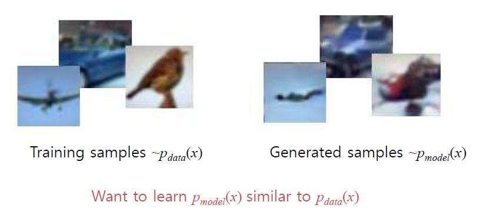
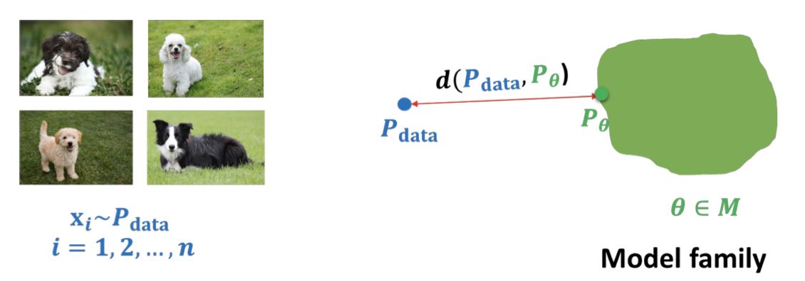

# **Computer Vision - Generative Model**
# **0. 생성 모델 아이디어** 💡

출처: https://wikidocs.net/151937

# 0-1. 생성 모델이란? 💁🏻‍♂️

- **생성 모델(generative model)** : 주어진 학습 데이터를 학습하고 학습 데이터의 분포를 따르는 유사 데이터를 생성하는 모델

- 즉, 주어진 training data와 같은 distribution을 가진 새로운 sample을 만들어내는 모델

 

- generative model은 classifier를 찾는 것이 목적이 아닌, **training set의 distribution을 배우는데 목적** 을 두고 있다.
    - 전체 데이터의 joint distribution을 학습
    - 세상에 실제로 존재하는 것은 아니지만 마치 존재할 것 같은 특히 우리가 학습시켜준 데이터들 사이에 정말로 존재할 것 같은 데이터를 만들어내는 것이 generative model의 목적

 

> ### 😃  $P_{model}(x)$와 $P_{data}(x)$가 유사하도록 학습:
> 
> 1. **Explicit Density**: $P_{model}$을 확실하게 정의
>     - ex) VAE, Approximate Density, etc.
> 2. **Implicit Density**: model을 확실하게 정의하지 않고 $p_{model}$에서 sample을 생성
>     - ex) GAN, Markov Chain, etc.

 
 

- 위의 그림과 같이 생성모델은 실제 세계의 데이터로부터 비슷한 Fake Data를 생성할 수 있습니다. 
- 또한, Time-series data 등은 생성모델에서 시뮬레이션이나 Planning에 사용 가능

 
 

### Example)

- 예를들어 아래 이미지에서 강아지 이미지를 만들어내는 generative model을 구축한다고 해보자.
- **Goal**: model의 distribution이 실제 데이터, $P_{data}$와 가장 가깝도록 만드는 것
 $$\min_{\theta \in \mathcal M} d(P_{data}, P_{\theta})$$

 
 

> ### 😃 generative model을 이용해 해결하는 문제는 3가지 정도로 요약 가능:
> 
> 1. **Density estimation**: 주어진 data point $x$에 대해서 model에 의해 할당되는 확률 $P_{\theta}(x)$을 구할 수 있을까?
> 2. **Sampling**: training에는 존재하지 않지만, training과 가장 비슷한 분포를 나타내는 model distribution으로 이미지를 만들어낼 수 있을까?
> 3. **Unsupervised representation learning**: 특정 datapoint $x$에서 의미있는 feature representation을 학습할 수 있을까?

 

- 좋은 generative model이라면? 🤔
    - **Density estimation**: 개라는 이미지에 대해서는 높은 확률 $P_{\theta}(x)$을, 그 외의 이미지에서는 낮은 확률을 보일 수 있어야 한다.
    - **Sampling**: 학습된 데이터셋에는 없지만 확실히 강아지인 이미지를 만들어낼 수 있어야 한다.
    - **representation learning**: 개의 품종과 같은 높은 수준의 feature를 찾을 수 있어야 함.

 
 

- generative model의 정량적인 evaluation 방법을 개발하는 것은 매우 활발하게 연구가 진행되고 있는 영역

 
 

