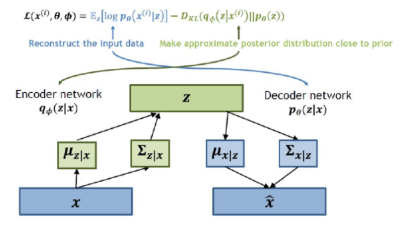

# **Computer Vision - Generative Model**
# **1. VAE (Variational Auto-Encoder)** 

출처: https://wikidocs.net/152474

# 1-1. VAE란? 💁🏻‍♂️

- **Goal of VAE**: Input image $x$를 잘 설명하는 feature를 추출하여 Latent vector $z$에 담고, 이 Latent vector $z$를 통해 $x$와 유사하지만 완전히 새로운 데이터를 생성하는 것

 

- 💡 각 feature가 가우시안 분포를 따른다고 가정
- 💡 latent $z$는 각 feature의 평균과 분산
- ✨ <U> latent $z$는 각 feature를 평균과 분산으로 저장</U>하는 것이다.

 

- $$z \rightarrow x$$

  $$p_{\theta^*} (z) \rightarrow p_{\theta^*}(x | z^{(i)})$$
  
    - where $p(z)$: latent vector $z$의 확률밀도함수. Gaussian이라고 가정
    - $p(x|z)$: 주어진 $z$에서 특정 $x$가 나올 조건부 확률에 대한 확률밀도함수
    - $\theta$: 모델의 파라미터

 

# 1-2. VAE의 구조 🤖

> - Input image $x$를 **Encoder**에 통과시켜 Latent vector $z$를 구하고, 
> - Latent vector $z$를 다시 **Decoder**에 통과시켜 기존 input image $x$와 비슷하지만 새로운 이미지 $x$를 찾아내는 구조

 

- VAE는 input image가 들어오면 그 이미지에서의 다양한 특징들이 각각의 확률 변수가 되는 어떤 확률 분포를 만든다.
- 이런 확률 분포를 잘 찾아내고, 확률값이 높은 부분을 이용하면 실제에 있을법한 이미지를 새롭게 만들 수 있을 것

 

# 1-3. VAE의 수식적 해석 📖

- Cosider the **Decoder**: $$z -(\text{Decoder Networks})\rightarrow x$$

- $p_\theta (z)$: $z$ latent variable의 확률분포
- $p_\theta (x | z^{(i)})$: $z$가 given일 때 $x$의 확률분포

 

- **학습 전략**: 네트워크의 출력값이 있을 때, 우리가 원하는 정답 $x$가 나올 확률이 높기를 바란다.
- 즉, $x$의 likelihood를 최대화하는 확률분포를 찾자:
$${\rm maximize}  (p_\theta(x)) = {\rm maximize} \int p_\theta (z) p_\theta (x|z) dz$$

 

- **Intractability of VAE**
$$p_\theta(x) = \int p_\theta (z) p_\theta (x|z) dz$$
$$p_\theta(x) = \dfrac{p_\theta(x|z) p_\theta (z)}{p_\theta (z | x)}$$

> - $p_\theta(x|z)$: Decoder Network
> - $p_\theta (z)$: Simple Gaussian prior

- ✨ Define additional encoder network $q_\phi (z | x)$ that approximates $p_\theta(z|x)$ ✨
- This allows us to derive a lower bound on the data likelihood that is tractable, which can optimize 

 

# 1-4. VAE 장단점

- 장점 : 확률 모델을 기반으로 했기 때문에, 잠재 코드를 더 유연하게 계산할 수 있다.
- 단점 : Density를 직접적으로 구한것이 아니기 때문에 Pixel RNN/CNN 과 같이 직접적으로 Density를 구한 모델보다는 성능이 낮다.

# 1-5. AE와 VAE

- VAE는 단순히 입력값을 재구성하는 AE에서 발전한 구조로 추출된 잠재 코드의 값을 하나의 숫자로 나타내는 것이 아니라, 가우시안 확률 분포에 기반한 확률값 으로 나타낸다.

- AE : 잠재 코드 값이 어떤 하나의 값
- VAE : 잠재 코드 값이 평균과 분산으로 표현되는 어떤 가우시안 분포