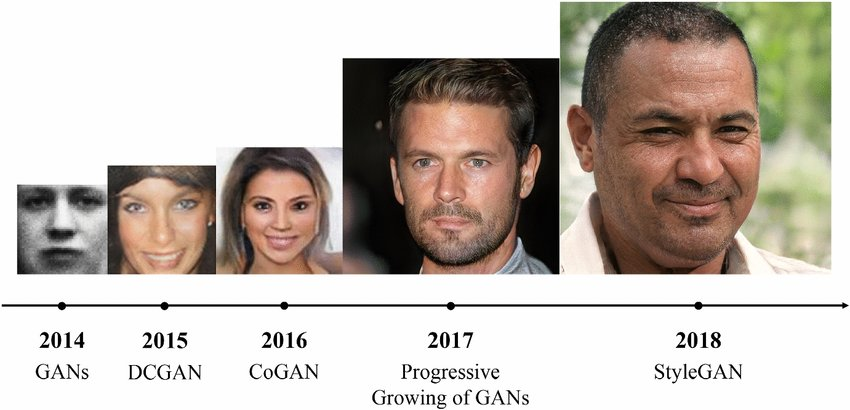
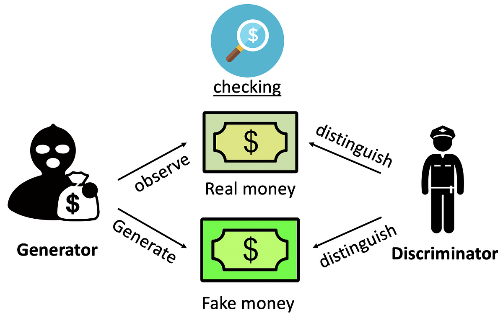
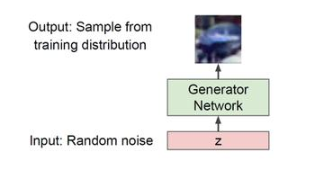
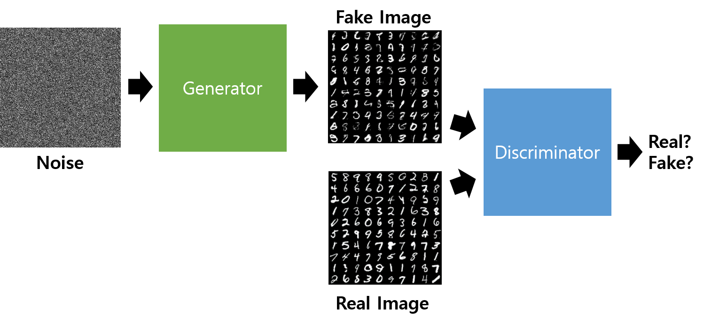
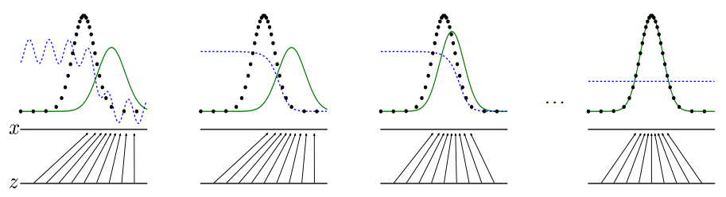
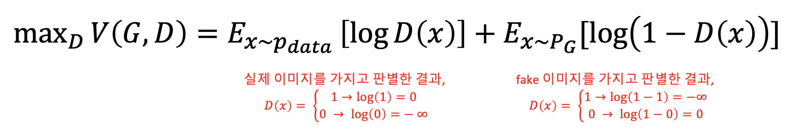
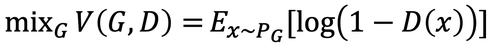
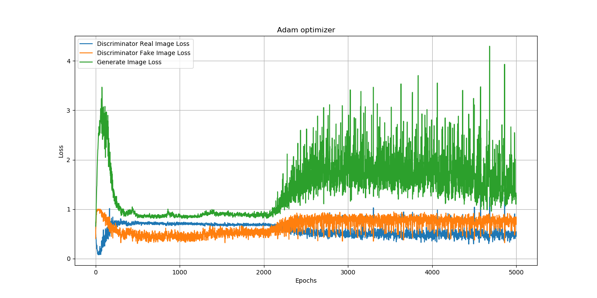
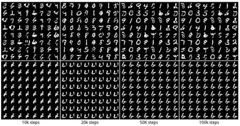
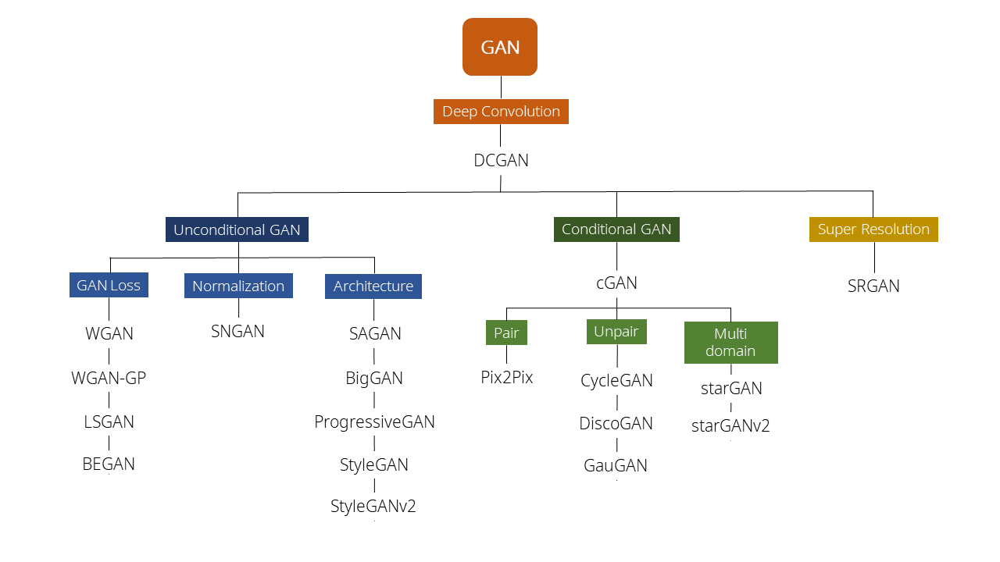

# **Computer Vision - Generative Model**
# **2. GANs (Generative Adversarial Networks)** 

출처: https://wikidocs.net/146217

# 2-1. Background 📚

- GAN은 2014년, Ian Goodfellow의 "Generative Adversarial Network"라는 논문에서 처음 제시
- 짧은 시간동안 상당한 발전을 보였다.

 

# 2-2. How GAN works?

 
 

- 📖 **GAN의 기본 철학** : 복잡한 고차원의 training distribution에서 sampling을 하고싶다.
- 이를 해결하기 위해 , simple distribution(e.g. random noise) 를 샘플링 해서, Training distribution 을 따르는 Transformation을 시킬 수 있는 파라미터를 학습하자! 는 전략

 

## 2-2-1. Generator and Discriminator

- GAN에는 위조지폐범에 해당하는 **Generator(G, 🥷🏻)** 와 경찰에 해당하는 **Discriminator(D, 👮🏻‍♂️)** 가 존재

  - 🥷🏻 **Generator**는 real data의 distribution을 학습해 fake 데이터를 만드는 일을 합니다.
    - → 최종적으로 이를 Discriminator가 최대한 <U>헷갈리게 하는 것을 목표</U>로 합니다.

  - 👮🏻‍♂️ **Discriminator**는 smaple이 realdata(training)인지 아닌지를 구분합니다.
    - → 최종적으로 Fake 이미지를 최대한 <U>잘 판별하는 것 을 목표</U>로 합니다.

 

 

## 2-2-2. Adversarial learning

 

- $p_{data}$:  training data의 distribution
- $p_g (G(z))$: Generator가 만들어낸 이미지의 분포

 

- GAN의 기본 구조 요약
  - (initial로 고정된) G로 생성
  - D로 classify, 업데이트
  - (D를 constant로 만들고) G 업데이트
  - (업데이트 된 상태로 고정된 ) G로 생성
  - D로 classify
  - (D를 constant로 만들고) G 업데이트
  - ...
  - 반복
  - ...
  - 이 과정을 반복하다가 D(x) = 1/2, 즉 discriminator가 구분할 수 없는 상태가 됨. $p_g = p_{data}$

 
 

## 2-2-3. Objective function of GAN

$$\min_\theta \max_\phi V(G_\theta, D_\phi) = \mathbb{E}_{\mathbf{x} \sim p_{data}(\mathbf{x})}[\log D_\phi (\mathbf{x})] + \mathbb{E}_{\mathbf{z} \sim p_{z}(\mathbf{z})}[\log(1-D_\phi(G_\theta(\mathbf{z})))]$$

### 2-2-3_1. 👮🏻‍♂️ Discriminator의 Objective function

- Discriminator는 classifier
  - 만들어낸 데이터 $x$가 **실제 데이터라면 1**을 리턴
  - **fake image라면 0**을 리턴

- $D(x)$: Discriminator의 리턴 값

- Discriminator의 Objective function은 아래와 같다:

 

 

- Discriminator의 objective function은 최대 값이 0, 최소 값은 $-\infin$
- 우리가 원하는 것: 항상 제대로 예측하는 discriminator가 되는 것, 즉 항상 최대값인 0의 성능을 보이기를 원한다.

- **gradient ascending**, 최대 기울기를 향해 학습되어야 함

 

 

### 2-2-3_2. 🥷🏻 Generator의 Objective function

- Generator는 자기가 만든 fake 이미지가 **얼마나 discriminator를 헷갈리게 했는지 이것만이 중요한 정보**

- ✨ 그래서 discriminator objective function의 뒷부분, fake 이미지에 대한 결과만 이용하면 된다. ✨

- Discriminator와 마찬가지로 최소 $-\infin$, 최대 0의 값을 가지는 문제
- Discriminator를 속이는 것이 목표이기 때문에 **gradient descent**를 시행

 

 

## 2-2-4. Optimizing GAN

### 2-2-4_1. $p_g = p_{data}$가 정말 global optimum인가?

- GAN의 기본 가정: $p_g = p_{data}$일 때를 optimum
- 이것이 합당한가?

 

- 어떤 G에 대해서든 optimal한 Discriminator를 갖고 있다고 가정

- 이 때 (고정된 G에 대한) D의 성능을 다음과 같이 정의할 수 있습니다. optimal 하다면 0.5로 수렴하겠죠.

$$D^*_G = \dfrac{p_{data}(x)}{p_{data}(x) + p_g (x)}$$

- 이 optimal 한 D에 대한 objective function은 아래와 같을 것

$$\max_D V(G, D) = \mathbb{E}_{\mathbf{x} \sim p_{data}(\mathbf{x})}[\log D (\mathbf{x})] + \mathbb{E}_{\mathbf{z} \sim p_{G}}[\log(1-D(\mathbf{x}))]$$

- 위의 식에서 기댓값을 $x$에 대한 함수로 나타내어 표시

$$V(G, D) = \int_x  p_{data}(x) \log D (\mathbf{x})  +  p_g(x) (1-D(G(\mathbf{x})))$$

- For all $(a,b) \in \mathbb{R^2}$, $y \rightarrow a \log(y) + b\log(1-y)$는 $a/(a+b)$에 Maximum으로 도달.

 

 

### 2-2-4_2. Jenson-Shannon Divergence (JSD)

- 위에서 구한 optimal D, $D_G^* = \dfrac{p_{data}(x)}{p_{data}(x) + p_g(x)}$ 를 objective function에 직접 넣어보자

$$\mathbb{E}_{\mathbf{x} \sim p_{data}(\mathbf{x})}[\log \frac{p_{data}(x)}{p_{data}(x) + p_g(x)}] + \mathbb{E}_{\mathbf{z} \sim p_{G}}[\log(1-\frac{p_{data}(x)}{p_{data}(x) + p_g(x)})]$$

$$= \mathbb{E}_{\mathbf{x} \sim p_{data}(\mathbf{x})}[\log \frac{p_{data}(x)}{p_{data}(x) + p_g(x)}] + \mathbb{E}_{\mathbf{z} \sim p_{G}}[\log(\frac{p_{g}(x)}{p_{data}(x) + p_g(x)})]$$

$$= \mathbb{E}_{\mathbf{x} \sim p_{data}(\mathbf{x})}[\log \frac{p_{data}(x)}{(p_{data}(x) + p_g(x))/2}] + \mathbb{E}_{\mathbf{z} \sim p_{G}}[\log(\frac{p_{g}(x)}{(p_{data}(x) + p_g(x))/2})] - \log 4$$

$$= D_{KL}[p_{data}, \frac{p_{data} + p_g}{2}] + D_{KL}[p_{g}, \frac{p_{data} + p_g}{2}] - \log 4$$

$$= 2 D_{JSD}[p_{data}, p_g]- \log 4$$

 

 

### 2-2-4_3. Optimizing GAN

 

 

# 2-3. Limitation

## 2-3-1. Training instability

## 2-3-1. Mode collapse

 

 

---
# 👨🏻‍🔬 Further study 

