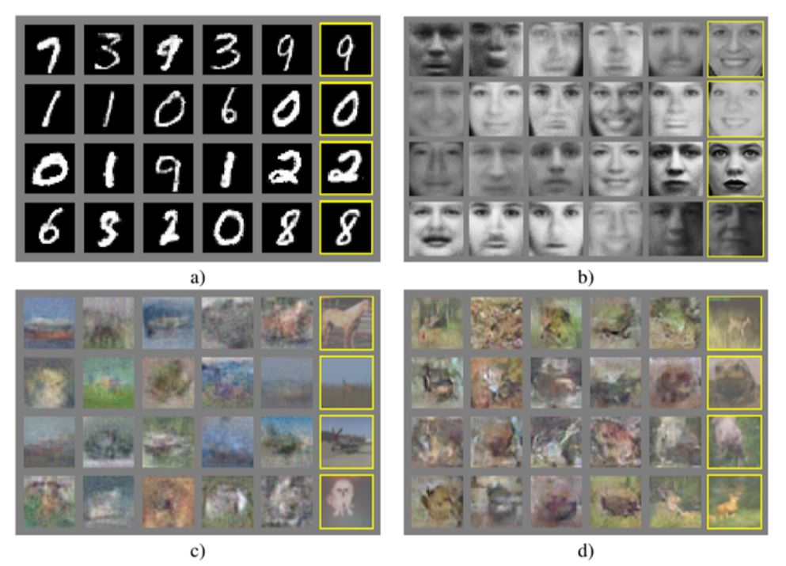
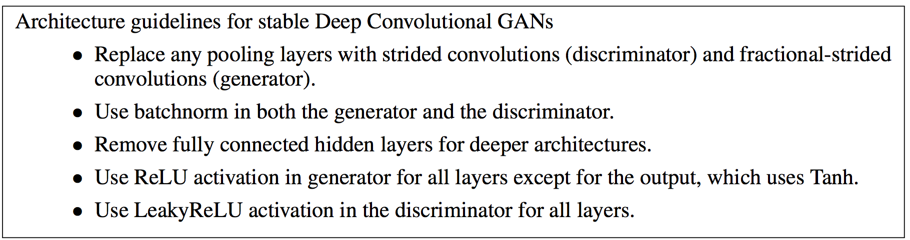
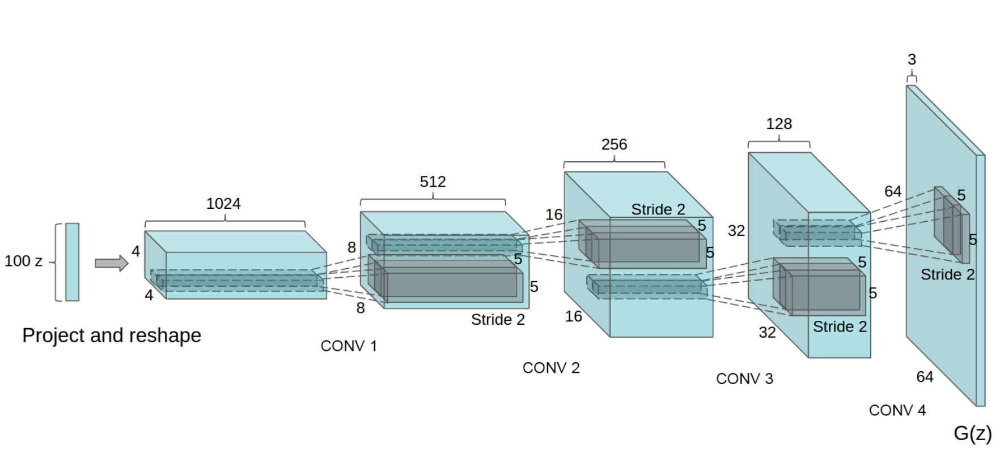
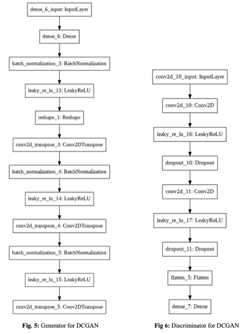
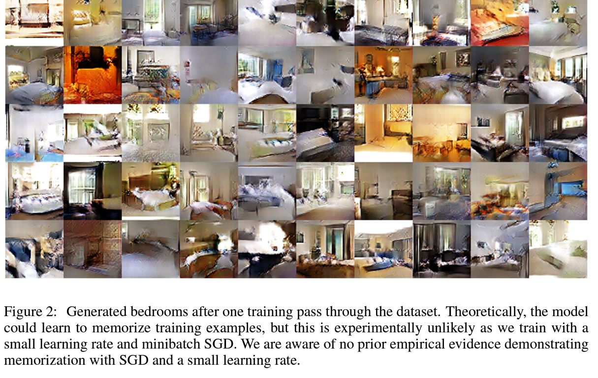
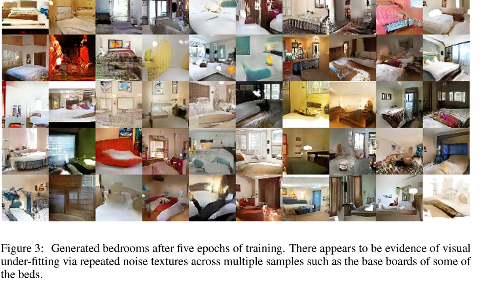
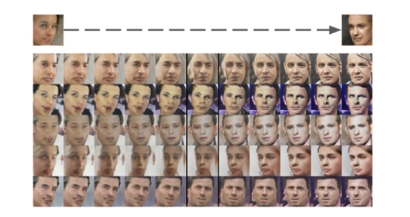

# **Computer Vision - Generative Model**
# **3. DCGAN (Deep Convolution GAN)** 

- 출처: https://wikidocs.net/146362

- 기본적인 응용 GAN 논문

- 2014년 Ian Goodfellow가 공개한 기존의 GAN은 MNIST 같은 비교적 단순한 이미지에서는 잘 작동했지만 CIFAR-10 같이 조금만 이미지가 복잡해져도 성능이 그닥 좋지 않았다.

- 또한 대부분의 Deep neural network와 마찬가지로 black box model 이었기에 성능을 개선하기에도 쉽지 않았다.

- 또 이때 당시만 하더라도 GAN이 생성한 결과물이 얼마나 잘 만들었는지 평가할 수 있는 지표가 없었다.

- => 이런 문제점을 해결하기 위해 등장한 모델이 DCGAN

 
 

# 3-1. DCGAN 네트워크 구조

- Fully connected layer와 Pooling layer를 최대한 배제하고 Strided Convolution과 Transposed Convolution으로 네트워크 구조를 만든다.

  - Fully connected layer와 Max-pooling layer는 매개변수의 수를 줄일 수 있지만 이미지의 위치 정보를 잃어 버릴 수 있다는 단점이 있다.

 

- Generator와 Discriminator에 배치 정규화(Batch Nomalization)을 사용
  - 이는 입력 데이터가 치우쳐져 있을 경우의 평균과 분산을 조정해주는 역할
  -  따라서 back propagation을 시행했을 때 각 레이에어 제대로 전달되도록해 학습이 안정적으로 이루어지는데 중요한 역할

 

- 마지막 layer를 제외하고 생성자의 모든 layer에 ReLU activation를 사용
- 마지막 layer에는 Tanh를 사용

- Discriminator의 모든 레이어에 LeakyReLU를 사용

- 다수의 실험을 통해 찾아낸 최적의 구조는 아래와 같다.

**DCGAN의 Generator 구조**

 
 

# 3-2. DCGAN의 성능

- DCGAN을 LSUN(Large-scale Scene Understanding) 데이터셋을 이용하여 학습
- 1 epoch 후에 얻은 결과가 Figure 2.에 제시
- 5 epoch 후에 얻을 결과는 Figure 3.에 제시되어 있는데 성능이 훨씬 더 좋아졌음을 확인

# 3-3. DCGAN의 학습

- DCGAN의 학습이 잘 이뤄졌는지 확인하기 위해 여러 가지 검증 방법을 도입
- 그 중 하나가 잠재 공간 (latent space, $z$)에 실제 데이터의 특성이 투영됐는지 살펴보는 것
- 사람 얼굴을 생성하는 모델이 잘 학습되면 성별, 머리 색깔, 얼굴 방향, 안경 착용 여부 등의 의미 있는 단위들이 잠재 공간에 드러나게 된다.
- 💡 **따라서 생성자의 입력인 100차원짜리 'z' 벡터의 값을 바꾸면 생성자의 출력인 이미지의 속성을 바꿀 수 있다.**

 

- 아래 사진은 DCGAN이 생성한 사람 얼굴 이미지에서 얼굴 방향에 해당하는 'z' 벡터의 값을 바꾸어서 얼굴이 바라보는 방향을 바꾼 것
- 이것이 가능하다는 것은 생성자가 얼굴의 의미적인 속성을 학습했다는 것

