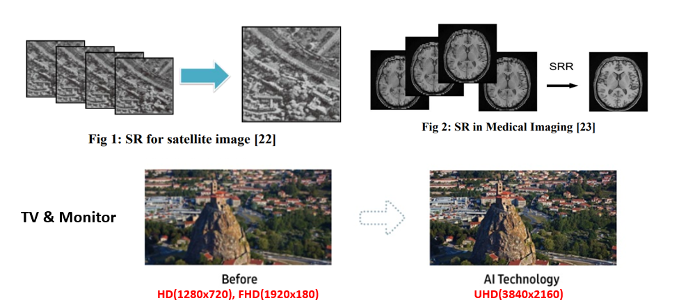
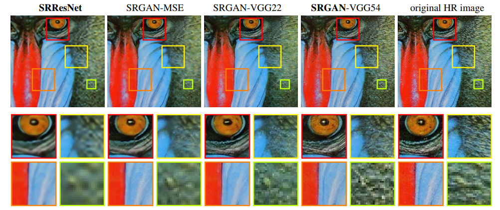
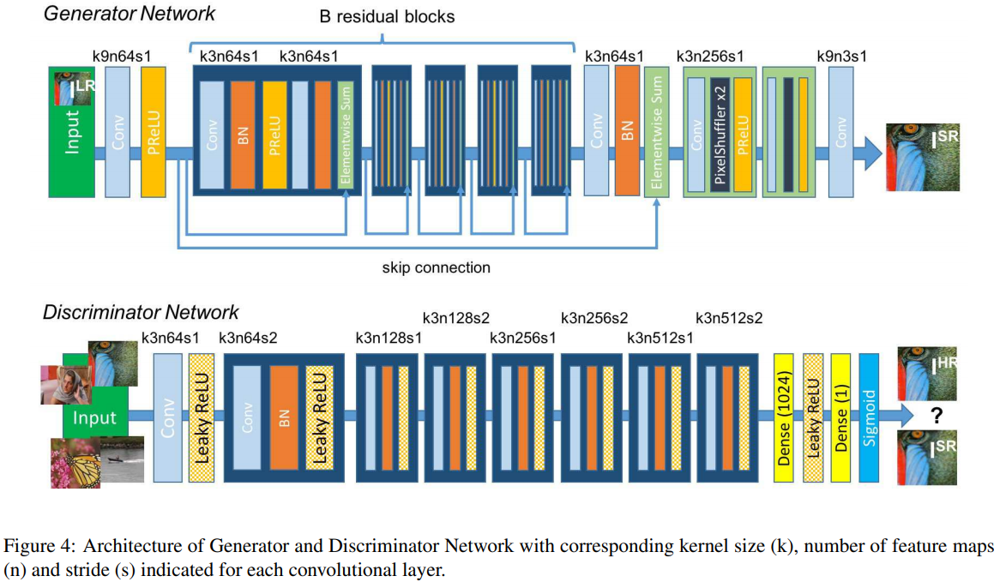
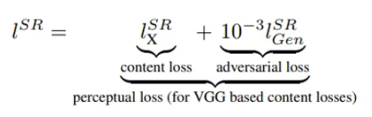
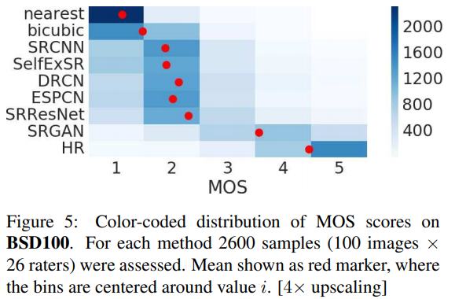

# **Computer Vision - Generative Model**
# **4. SRGAN (Super Resolution GAN)** 

출처: https://wikidocs.net/146367

- **Image Super Resolution(SR)**: 저해상도(Low Resolution) 이미지를 고해상도 이미지(High Resolution) 이미지로 변환시키는 문제

- 일반적으로 SIngle Image Super Resolution 문제를 접근하는 방식은 크게 3가지

1. Interpolation-based method
2. Reconstruction-based method
3. (Deep) Learning-based method

- Deep Learning-based method인 SRGAN을 중점적으로 확인할 예정

 
 

# 4-1. Introduction

- Super Resolution의 (Deep) Learning-based method의 초기 모델부터 GAN을 사용한 것은 아니었다.
- 최초로 deep learning을 super resolution에 적용한 SRCNN 이후 더 빠르고, 더 깊은 CNN 모델들이 제시되었음에도 불구하고 해결되지 않은 문제점이 있었다.

- 기존 SR 모델 중 하나인 SRResNet이 생성한 이미지를 매우 확대해보면, original HR image와 비교했을 때 texture detail이 좋지 않음을 확인할 수 있다.

 

-  <U> 이 원인이 기존 SR 모델들의 **loss function**에 있다</U>고 보았다.

    - 기존 SR 모델들의 목표는 보통 복구된 HR 이미지와 원본 이미지의 pixel 값을 비교하여 pixel-wise MSE를 최소화하는 것

    - 그러나 pixel-wise loss를 사용하면 high texture detail을 제대로 잡아내지 못하는 한계가 있다.

- 저자들은 이전 연구와는 다르게 VGG network의 high-level feature map을 이용한 **perceptual loss**를 제시하여 이런 문제를 해결하였다고 한다.

 
 

# 4-2. 네트워크 구조

## 4-2-1. Generator network, G

- 똑같은 layout을 지닌 B개의 residual block으로 구성

### ⚙️ Residual block의 구성

- kernel size: 3 x 3
- kernel 개수: 64
- stride: 1
- Batch normalization layer
- Activation function: ParametricReLU

 

- 일반적으로 convolution layer를 이용하면 그 image의 차원은 작아지거나 동일하게 유지
- super resolution을 위해 image의 dimension을 증가시켜야 함 🤔
- 여기서 이용된 방식이 **sub-pixel convolution**

 

## 4-2-2. Discriminator Network, D

- LeakyReLU($\alpha = 0.2$)를 사용했고, max-pooling은 이미지 크기를 줄이므로 사용하지 않음
- 3 × 3 kernel을 사용하는 conv layer 8개로 구성
- feature map의 수는 VGG network처럼 64부터 512까지 커짐.

- 마지막 feature maps 뒤에는 dense layer 두 개, 그리고 classification을 위한 sigmoid가 붙는다.

 
 

# 4-3. Loss function - Perceptual loss 💡

- Loss function으로 **Perceptual loss**를 사용
  - content loss와 adversarial loss로 구성

 

- 이중 adversarial loss는 우리가 일반적으로 알고 있는 GAN의 loss와 비슷

---

## 4-3-1. Adversarial loss

$$l^{SR}_{Gen} = \sum^N_{n=1} - \log D_{\theta_D} (G_{\theta_G} (I^{LR}))$$

- Generator가 생성한 이미지를 진짜라고 판단할 확률로 앞에 - 가 붙어있으므로 이를 최소화하는 방향으로 학습

- 기존 GAN loss는 $\log (1-x)$의 형태로 되어잇으나 이러면 training 초반 부에 학습이 느리다는 단점이 있다고 합니다.

- 이를 $- \log (x)$ 형태로 바꾸어주면 학습 속도가 훨씬 빨라진다고 함

 

## 4-3-2. Content loss

$$l^{SR}_{VGG/i,j} = \dfrac{1}{W_{i,j} H_{i,j}} \sum^{W_{i,j}}_{x=1} \sum^{H_{i,j}}_{y=1}( \phi_{i,j}((I^{HR})_{x,y})  -  \phi_{i,j}( G_{\theta_G} (I^{LR}) )_{x,y}       )^2$$

- 시그마 안에 값 = Generator가 생성한 이미지와 original HR 이미지로 부터 얻은 Feature map 사이의 Euclidean distance

---

 

- **Per-pixel loss**: Generator을 이용해 얻어낸 가짜 고해상도 이미지를 진짜 고해상도 이미지와 Pixel by pixel로 비교하는 것
- **Perceptual loss**: 각 이미지를 pre-trained CNN 모델에 통과시켜 얻어낸 feature map을 비교하는 것

 
 

# 성능

- SR GAN이 생성한 이미지를 매우 확대해보면, SRResNet이 만든 이미지와 비교했을 때 texture detail이 좋아졌음을 확인할 수 있다.

- 또한 MOS (Mean Opinion score) testing을 진행하였을 때 SRGAN의 엄청난 성능을 확인
  - MOS (Mean Opinion score) testing은 26명의 사람에세 1점(bad) 부터 5점 (excellent)까지 점수를 매기도록 한 것

