# **Computer Vision - Generative Model**
# **5. Cycle GAN** 

출처: https://wikidocs.net/146366

- **image to image translation**: 이미지 데이터셋을 사용하여 input 이미지와 output 이미지를 mapping하는 것을 목표로 하는 생성 모델의 한 분야

- image to image translation의 대표적 모델로 다음이 있다:
  - Pix-2-Pix
  - Cycle GAN 
  - Style GAN 
  - ...

 

- Pix-2-Pix가 처음 등장하였고 이후 Pix-2-Pix의 단점을 해결하기 위해 Cycle GAN이 등장
- Style GAN은 Cycle GAN을 베이스로 하여 개발

 
 

# 5-1. Pix-2-Pix - Related work

- 일반적인 CNN 모델에서 설정하듯, Generator가 만들어낸 이미지와 실제 이미지 사이의 유클라디안 거리를 최소화하도록 Loss function을 설정하면 아래와 같이 표현:
  - $x$: input image
  - $G(x)$: 모델이 생성한 이미지
  - $y$: Ground truth

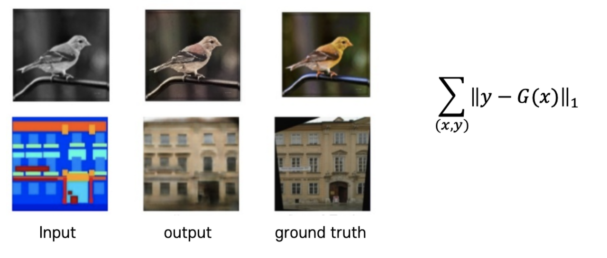

- 문제는 이런 loss function을 설정하면 가운데 사진과 같이 뿌옇게 (blurring) 표현된 output이 나온다.
  - 이는 Generator가 input image만 보면 벽이 나무로 되어있는지, 흰색 벽돌로 되어있는지 / 새의 깃털 색이 어떤지 전혀 알 수 없으므로
  - Generator는 어느 것을 택해도 loss가 너무 커지지 않도록 **애매한 중간값**을 택하는 경향

 

- 이를 해결하기 위해 저자들은 **conditional GAN (cGAN)** 을 추가 

- GAN은 어떤 데이터 분포를 입력받아 실제에 가깝게 데이터를 생성하는 모델이기 때문에 input image와 비슷하나 다른, 새로운 이미지를 생성

- cGAN은 ground truth ($y$)를 추가로 Generator에 제시하여 input image를 ground truth ($y$)와 '연관된' 이미지로 전환할 수 있다.

- 이러한 cGAN의 특성은 image to image translation의 목표, 즉 특정 이미지를 제시하고 해당 이미지를 우리가 원하는 방향으로 변환하는데 아주 적합.

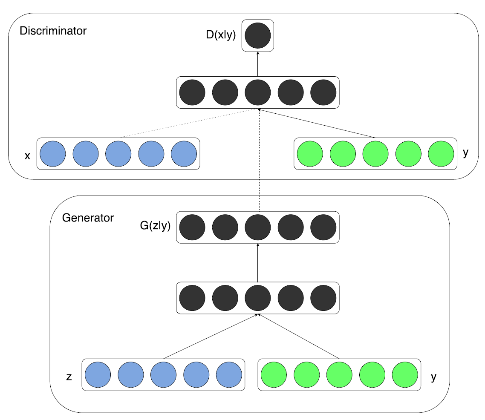

 
 

## 5-1-1. Pix-2-Pix의 loss function

- 최종 pix2pix의 loss function:
$$G^* = \arg \min_G \max_D \mathcal{L}_{cGAN} (G, D) + \lambda \mathcal{L}_{L1}(G)$$

- 첫 번째 항은 cGAN의 loss function:

  - $z$: random noise vector
  - $x$: input image
  - $y$: ground truth

$$\mathcal{L}_{cGAN} (G,D) = \mathbb{E}_{x,y} [\log D(x,y)] + \mathbb{E}_{y,z}[\log (1 - D(G(y,z)))]$$

- 두 번째 항은 만들어낸 이미지와 실제 이미지간의 격차를 줄여주는 loss function인 L1 loss function:

$$\mathcal{L}_{L1}(G) = \mathbb{E}_{x,y,z}[|| x - G(y,z) ||_1]$$

 

 

## 5-1-2. Pix-2-Pix의 성능과 한계

- cGAN과 L1 loss를 모두 사용한 경우 가장 훌륭한 결과가 나온다.

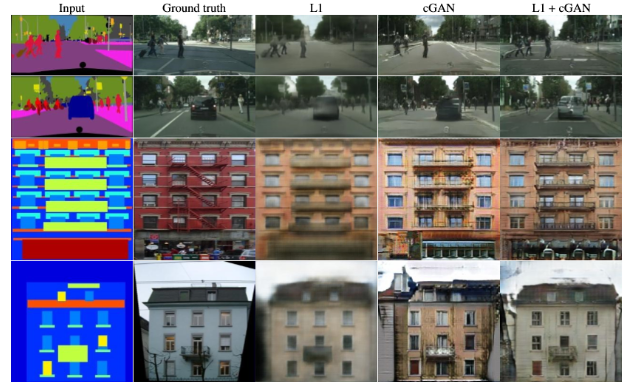

- 문제는 Pix-2-Pix를 학습시키기 위해 paired image 데이셋이 필요하다

- Pix-2-Pix 학습을 위해 paired image 데이터를 구하는 비용이 크며 어떤 경우 불가능하기도 하다.

- 이런 단점을 해결하기 위해 등장한 모델이 Cycle GAN

 

 

# 5-2. Cycle GAN의 구조

- 💎 unpaired image 데이터를 가지고 image to image translation를 하는 것이 cycle GAN의 목적!

- 이때 모델의 loss function을 GAN의 Loss function으로 사용하는 경우 **Mode collapse** 문제

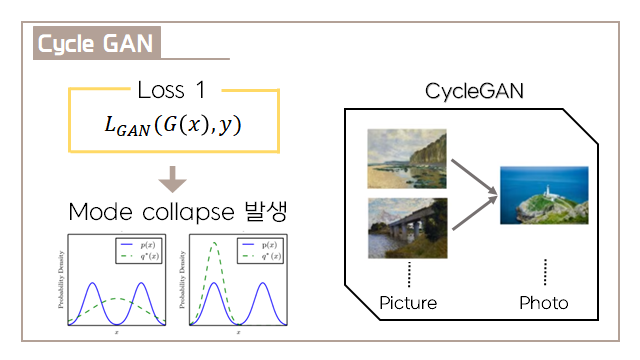

- Mode Collapse

  - 실제 데이터 분포가 $p(x)$ (파란색 실선)라고 주어졌을 때, 우리는 generator가 이 실제 데이터의 분포와 유사하게 학습하기를 바란다.

  - 그러나 GAN loss를 이용해 학습을 하다보면 Generator가 $q'(x)$ (초록색 점선)과 같이 하나의 mode에만 강하게 몰리게 되는 경우가 발생.

  - 이렇게 되면 input의 특징을 다 잊어버리고 똑같은 출력을 생성

 

- ✨ 이를 해결하기 위해 기존의 Generator G 외에 <U>Generator F를 추가</U>한 순환구조가 등장

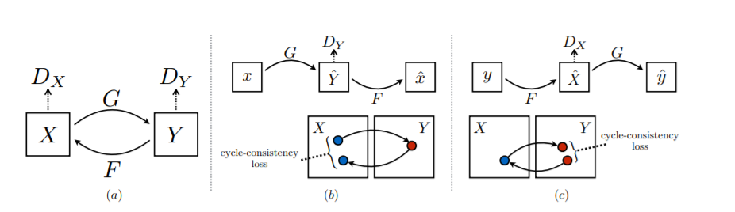

- **forward consistency**: input image에서 output image로 맵핑하는 동작 과정 (b)

- **backward consistency**: 반대의 과정 (c)

- **순환 일관성(Cycle Consistency)**: Generator G와 F를 거쳐서 한 바퀴 돌아오면 다시 자기 자신으로 돌아오는 것

- **cycle consistency loss**: Input image와 Generator G, F 한 바퀴를 돌아 생성된 Output image 간의 차이

 

---

- **Forward cycle consistency**
  - $X$를 Generator $G$에 넣어 $G(X)$ 혹은 $\hat Y$를 출력
  - $Y$와 $G(X)$를 Discriminator에 제시하여 결과물 $D_Y$를 출력
  - $G(X)$, 혹은 $\hat Y$을 Generator $F$에 넣어 $\hat X$으로 복구
    - 결론: $X \rightarrow G(X) \rightarrow F(G(X)) \approx X$

 

- **Backward cycle consistency**
  - $Y$를 Generator $F$에 넣어 $F(Y)$ 혹은 $\hat X$를 출력
  - $X$와 $G(Y)$를 Discriminator에 제시하여 결과물 $D_X$를 출력
  - $F(Y)$, 혹은 $\hat X$을 Generator $G$에 넣어 $\hat Y$으로 복구
    - 결론: $Y \rightarrow G(Y) \rightarrow F(G(Y)) \approx Y$

---

 

- cycleGAN 구조의 핵심은 input을 주었을 때 의도한 방향으로 바꾸되, 이걸 다시 원래의 input으로 되돌릴 수 있을 정도로 바꾸라는 것
- Mode collapse를 해결할 수 있다.

 

## 5-2-1. Cycle GAN의 loss function

- Cycle GAN의 loss function은 아래와 같이 나타낼 수 있으며, 각 항목은 크게 두 부분으로 나누어 진다.

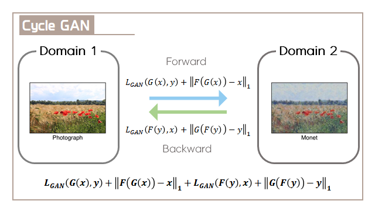

- **Adverarial Loss**

  - CycleGAN 역시 생성모델이기에 adversarial loss를 사용
  - 일반적인 GAN처럼 Cross Entropy loss를 사용하지 않고 Least Square loss를 사용
  - Forward & Backward Adverarial Loss를 모두 더해줌

  $$L_{GAN} (G, D_Y, x, y) = \mathbb{E}_{y\sim P_{data}(y)}[\log D_Y(y)]  + \mathbb{E}_{x \sim p_{data}(x)}[ \log (1 - D_Y (G(x)))]$$ 

- **Cycle Consistency Loss**

$$L_{cyc}(G, F) = \mathbb{E}_{x \sim p_{data}(x)}[ || F(G(x)) - x ||_1] + \mathbb{E}_{y \sim p_{data}(y)}[ || F(G(y)) - y ||_1]$$

 

 

# 5-3. 성능

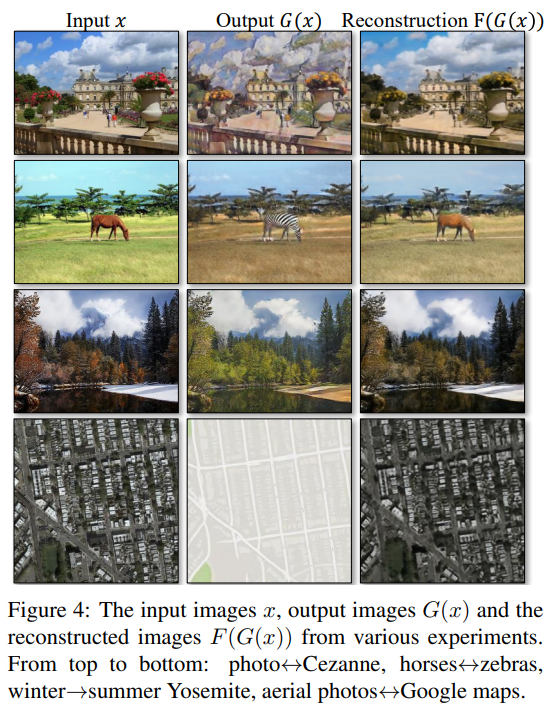

 

 

# 5-4. Cycle GAN의 활용

## 5-4-1. Style Transfer

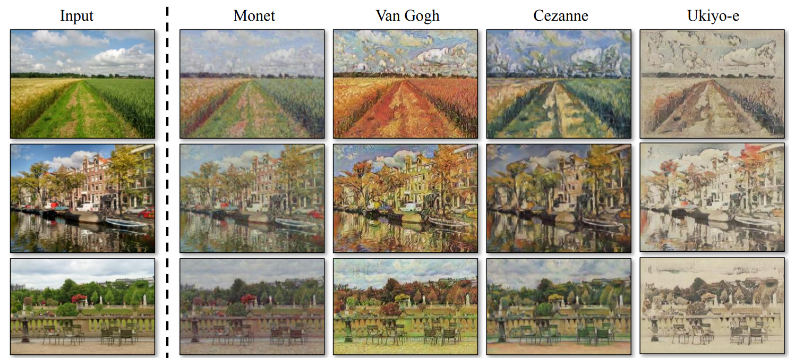

 

## 5-4-2. Season Transfer

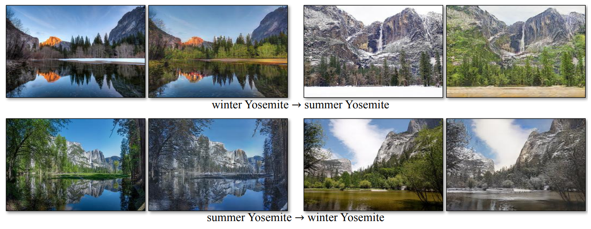

 

## 5-4-3. Photo generation from paintings 
- 모네의 그림을 사진처럼 바꿔줍니다.

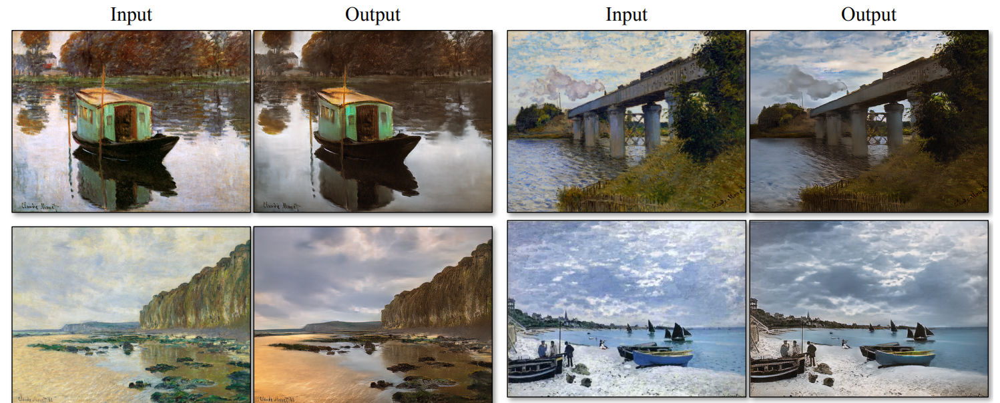

 

## 5-4-4. Photo enhancement 
- 스마트폰으로 찍은 사진을 DSLR로 찍은 것처럼 바꿔줍니다.

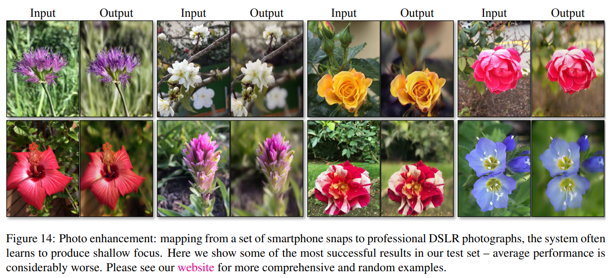

 

 

 

# 5-5. 한계

- 이미지의 모양을 바꾸진 못합니다. CycleGAN은 주로 분위기나 색상을 바꾸는 것으로 스타일을 학습하여 다른 이미지를 생성합니다. 그러다보니 피사체의 모양 자체는 바꿀 수가 없었습니다.

  - ex) 사과를 오렌지로 바꾸는 작업

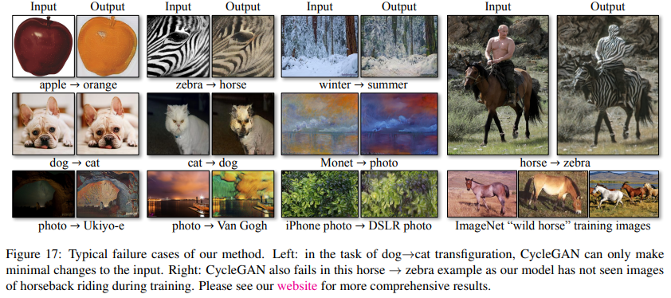

 

- 데이터셋의 분포가 불안정하면 이미지를 제대로 생성할 수 없게 됩니다.
  
  - ex) 사람을 태운 말을 얼룩말로 바꿀 때 사람까지 얼룩말이 되는 것은 데이터셋에 사람이 말을 탄 데이터가 없기 때문