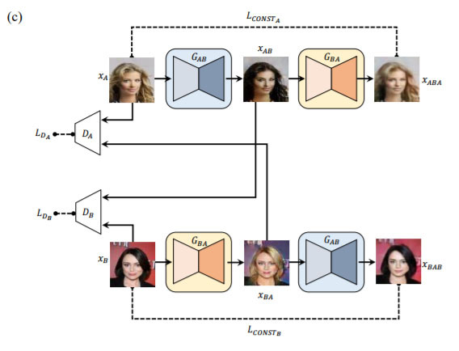

# **Computer Vision - Generative Model**
# **6. Disco GAN** 

출처: https://wikidocs.net/152500

# 6-1. Disco GAN 이란?

- Disco GAN은 앞에서 나온 Cycle GAN과 매우 유사한 방식의 알고리즘
- 기존의 Pix2Pix 모델의 한계점은 Paired Dataset이 필요하다는 점
- 말을 통해 얼룩말을 생성하려면 생성하려는 얼룩말과 똑같은 자세로 있는 말이 필요
- Paired Dataset은 구하기 어렵고, 존재하지 않을 확률이 크다.
- Disco GAN은 Paired Dataset이 구하기 힘든 경우에도 Style Transfer가 가능하게 한 GAN 알고리즘

 
 

# 6-2. 

