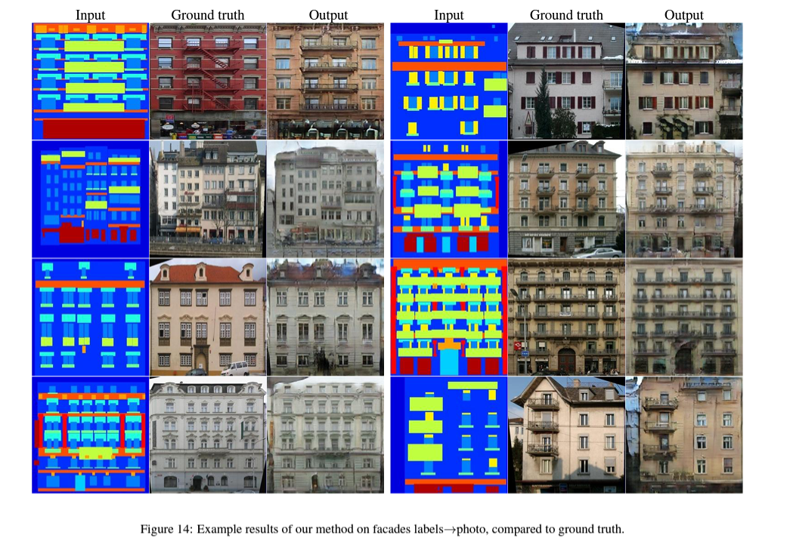

# **Computer Vision - Generative Model**
# **8. Image to Image Translation with Conditional Adversarial Networks** 

출처: https://velog.io/@sjinu/%EB%85%BC%EB%AC%B8%EB%A6%AC%EB%B7%B0%EC%A0%95%EB%A6%AC-Image-to-Image-Translation-with-Conditional-Adversarial-Netspix2pix

# 8-0. Pix-2-Pix

 

- **Image-to-Image Translation**: 이미지를 입력으로 받아 또다른 이미지를 출력으로 반환하는 문제들

 
 

# 8-1. Introduction 💁🏻‍♂️

- **cGAN**

> - 기존의 GAN과는 다르게 $G$는 condition $x$를 받아 생성
> - $D$ 또한 condition $x$를 받아 판별

 

- ✨ Image-to-Image Translation에 적합한 cGAN을 기반으로하며 다양한 task에서 좋은 결과를 보이는 프레임워크 **pix2pix**를 선보임

- Image-to-Image Translation은 보통 GAN의 변형 중 **cGAN(Conditional GAN)** 을 기반

 

 

### ✔️ **Loss function**

- $G$: Generator
- $D$: Discriminator
- $x$: input image
- $y$: output image
- $z$: latent vector

$$\mathcal{L}_{cGAN} (G, D) = \mathbb{E}_{x,y} [log D(x,y)] + \mathbb{E}_{x,z} [\log (1 - D(x, G(x,z)))]$$

> - $(x,y)$가 하나의 Train data pair이다.
> - $y$ 와 $G(x,z)$를 비교

- 💡 최적의 생성자 $G^*$를 얻기 위해서 생성자 $G$는 위 loss function $\mathcal L_{cGAN}(G, D)$를 최소화 하는 방향으로, 판별자 $D$는 최대화 하는 방향으로 학습을 진행

 

- 위의 loss를 단순히 산용하기보다는 traditional loss (L1 norm, L2 norm)를 추가하면 더 나은 이미지 생성 가능

    - $\mathcal{L1}(G) = \mathbb{E}_{x,y,z}[|| y - G(x,z) ||_1]$
    - $\mathcal{L2}(G) = \mathbb{E}_{x,y,z}[ (y - G(x,z))^2 ]$

    - -> 생성자 $G$가 생성 이미지를 좀더 $y$에 가까워지게끔 추가한 loss

 

- 본 논문의 최종적인 loss는 다음과 같다

$$G^* = \arg \min_G \max_D \mathcal{L}_{cGAN} (G,D) + \lambda \mathcal{L}_{L1}(G)$$

- 생성 이미지에 영향을 주기 위해 쓰이기 때문에 잠재 벡터 $z$를 random noise vector라고 부르기도 한다.

- pix2pix의 저자들은 train, test time에 dropout을 적용해 노이즈를 부여

 
 

# 8-2. Architecture 🤖

## 8-2-1. Generator

### 8-2-1_1. UNET

- pix2pix 연구에서 Generator로는 <U>인코더-디코더 구조에 + 스킵커넥션</U>이 추가된 **U-Net**을 사용
-U-Net은 skip connection을 (대칭적으로) 추가해 이 경로를 통해 detail(fine)한 부분 또한 전달할 수 있게 함

 

### 8-2-1_2. UNET 심화

- 대칭구조이다.

- **Contracting path**: 이미지의 전반적인 context 정보를 얻기 위한 네트워크 (좌)
- **Expanding path**: 정확한 지역화(Localization)을 위한 네트워크 (우)
    - 이 때 사용할 세밀한 정보가 바로 skip-connection을 통해 주어짐

    - 얖은 layer는 fine(local)한 정보를 담으며 / 깊은 layer는 corase(global)한 정보를 담는다.

- 이러한 구조를 통해 정보 손실을 낮추고, 기존의 Localization(details, fine)과 Context(semantic, global)의 trade-off 관계를 해결할 수 있다.

 
 

## 8-2-2. Discriminator (PatchGAN)

- pix2pix2의 판별자로는 **PatchGAN**을 사용

---
- L1 loss의 성질?

- L1 loss만을 사용할 경우 이미지의 Low-frequency 성분들을 잘 검출

    - 이미지에서의 Frequency란 한 마디로 픽셀 변화의 정도입니다. 즉, 사물에 대해서는 사물 내에서는 색 변화가 크지 않기 때문에 low-frequency라 할 수 있고, 사물 경계(즉, edge)에서는 색이 급격하게 변하기 때문에 high-frequency라 할 수 있습니다.

 

- L1 loss를 사용할 경우 blurry하지만 low-frequency 성분들을 잘 검출해내므로, 이는 그대로 두고 Discriminator에서 high-frequency의 검출을 위한 모델링을 진행

- 이를 위해서는 이미지 전체가 필요 없고 local image patch를 사용해 판별을 진행해도 상관 없다.
---

### 8-2-2_1. PatchGAN 심화

- **ImageGAN** : 일반적인 GAN은 이미지 전체에 대한 진위 여부를 판단합니다.
- **PatchGAN** : cGAN에서는 종종 PatchGAN을 사용하게 되는데, 이 때는 N×N 사이즈의 이미지 패치 단위에 대한 진위 여부를 판단하게 됩니다.
- **PixelGAN** : 이미지 픽셀 단위에서 진위 여부를 판단합니다.

 

- 기존의 GAN은 이미지 전체를 보고 $D$가 판단하므로, 결과 이미지에 블러(low-frequency)가 껴서 나타날 수 있다. (L1만 쓰는 것보다는 낫다.)
    - 전체적인 이미지만 그럴듯하게 만들면 될 뿐, 사물의 디테일들을 디테일하게 만들 필요가 없으므로

- 전체 이미지(Low-frequency)에 대한 판단을 L1 loss에 맡기고, High-frequency는 GAN에게 맡긴다.

 
 

# 8-3. Experiments

- 위와 같이 Input segmentation이 cGAN의 조건으로 주어짐

