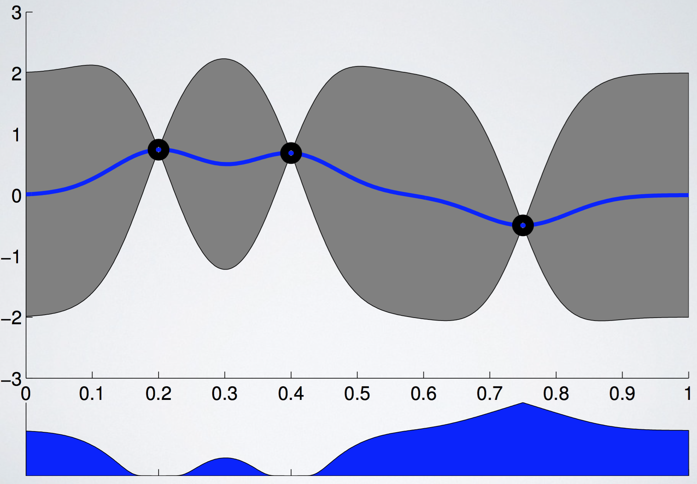

# **Practical Bayesian Optimization of Machine Learning Algorithms**

- Snoek, J., Larochelle, H., & Adams, R. P. (2012). Practical Bayesian Optimization of Machine Learning Algorithms. In Advances in Neural Information Processing Systems (pp. 2951-2959). (https://arxiv.org/abs/1206.2944)

- *베이지안 최적화(Bayesian optimization)는 값들을 관측해가며 최적의 함수를 찾아가는 글로벌 최적화 기법입니다. 주요 목표는 가능한 한 적은 수의 관측을 통해 목표 함수를 최적화하는 것입니다. 이 방법은 블랙박스 함수에 대해 효과적으로 작동하며, 이러한 함수는 계산 비용이 많이 들거나, 그래디언트 정보가 없거나, 노이즈가 있는 경우에 사용됩니다.*

  이거랑 hyper-parameter를 찾는거랑은 무슨 연관이 있지? 어떻게 hyper-parameter를 찾는거야?  

- 베이지안 최적화는 하이퍼파라미터 최적화에 널리 사용되는 방법 중 하나입니다. 머신러닝 모델의 성능은 선택된 하이퍼파라미터에 크게 영향을 받습니다. 하이퍼파라미터는 모델 학습 과정에서 자동으로 업데이트되지 않는 모델의 설정 값입니다. 예를 들어, 신경망의 층(layer) 수, 뉴런의 수, 학습률(learning rate), 정규화(regularization) 계수 등이 있습니다.

- 하이퍼파라미터 최적화의 목표는 이러한 하이퍼파라미터를 조정하여 모델의 성능을 최대한 높이는 것입니다. 베이지안 최적화를 사용하여 하이퍼파라미터를 찾는 과정은 다음과 같습니다.

- 목표 함수 정의: 목표 함수는 모델의 성능을 측정하는 지표를 사용해 하이퍼파라미터 설정에 대한 점수를 계산합니다. 예를 들어, 교차 검증(cross-validation)을 사용하여 주어진 하이퍼파라미터 설정에 대한 모델 성능을 평가할 수 있습니다.

- 서로게이트 모델 학습: 베이지안 최적화를 사용하여 목표 함수의 불확실성을 모델링하고, 가우시안 프로세스와 같은 서로게이트 모델을 사용하여 하이퍼파라미터 공간에서 최적의 지점을 찾습니다.

- Acquisition Function 사용: 탐색-활용 트레이드오프를 고려하여 다음 하이퍼파라미터 설정을 선택합니다. 예를 들어, Probability of Improvement (PI), Expected Improvement (EI), 또는 Upper Confidence Bound (UCB)를 사용할 수 있습니다.

- 새로운 하이퍼파라미터 설정 평가: 선택한 하이퍼파라미터 설정을 사용하여 모델을 학습시키고 목표 함수를 평가합니다.

- 반복: 새로운 하이퍼파라미터 설정과 목표 함수 값을 데이터에 추가하고, 서로게이트 모델을 업데이트한 다음, 다음 하이퍼파라미터 설정을 선택합니다. 이 과정은 미리 정의된 종료 조건이 충족될 때까지 반복됩니다(예: 반복 횟수, 허용 오차 등).

- 이 과정을 통해 베이지안 최적화는 하이퍼파라미터 공간에서 성능을 최적화하는 설정을 찾아갑니다. 최종적으로 베이지안 최적화가 완료되면, 가장 높은 목표 함수 값을 얻은 하이퍼파라미터 설정을 선택합니다. 이렇게 선택된 하이퍼파라미터를 사용하여 모델을 학습시키면, 일반적으로 검증 데이터셋에 대해 더 나은 성능을 보이게 됩니다.

- 베이지안 최적화는 하이퍼파라미터 최적화에 사용되는 다양한 방법 중 하나로, 그리드 탐색(grid search)이나 랜덤 탐색(random search)에 비해 목표 함수 평가 횟수를 줄이는 데 효과적입니다. 이를 통해 계산 비용이 높은 머신러닝 모델의 하이퍼파라미터 최적화에 효율적으로 사용할 수 있습니다. 그러나 베이지안 최적화의 성능은 서로게이트 모델과 Acquisition Function의 선택에 따라 다소 달라질 수 있습니다. 따라서, 특정 문제에 대해 적합한 설정을 찾는 것이 중요합니다.

  3번 "Acquisition Function 사용" 단계에서 하이퍼파라미터 설정을 선택하는거야? 

네, 맞습니다. 3번 "Acquisition Function 사용" 단계에서는 하이퍼파라미터 설정을 선택하는 것이 핵심입니다. Acquisition Function은 서로게이트 모델(가우시안 프로세스 등)의 예측 결과와 불확실성 정보를 바탕으로, 탐색(Exploration)과 활용(Exploitation) 사이의 균형을 맞추어 하이퍼파라미터 설정을 선택합니다.

여기서 탐색(Exploration)은 하이퍼파라미터 공간에서 아직 평가되지 않은 영역을 샘플링하여 목표 함수의 불확실성을 줄이는 것을 의미합니다. 반면, 활용(Exploitation)은 현재까지 알려진 가장 좋은 하이퍼파라미터 설정 근처에서 샘플링하여 목표 함수의 값을 더 높이려는 것을 의미합니다.

Acquisition Function의 예로는 Probability of Improvement (PI), Expected Improvement (EI), 그리고 Upper Confidence Bound (UCB) 등이 있습니다. 이러한 함수들은 서로게이트 모델의 예측 평균과 분산을 입력으로 받아, 각 하이퍼파라미터 설정에 대한 점수를 계산합니다. 점수가 가장 높은 하이퍼파라미터 설정을 선택하여 다음 단계로 진행합니다.

따라서, Acquisition Function은 베이지안 최적화 과정에서 새로운 하이퍼파라미터 설정을 선택하는 역할을 합니다. 이를 통해 더 나은 성능을 얻을 가능성이 있는 하이퍼파라미터 설정을 찾아내는 것이 목표입니다.

  그럼 핵심은 함수값을 GP로 높고, 다음으로 관측할 지점을 어떤 decision rule을 통해 선택 한다음, 하이퍼 파라미터를 고르고, 실제 머신러닝 모델을 돌려보며 성능을 측정하는거야? 

네, 맞습니다. 베이지안 최적화의 핵심은 목표 함수의 값을 높이기 위해 하이퍼파라미터를 조정하는 것입니다. 이를 위해 아래와 같은 과정을 거칩니다.

서로게이트 모델(GP) 학습: 목표 함수의 값을 추정하기 위해 가우시안 프로세스(GP)와 같은 서로게이트 모델을 사용합니다. 이 모델은 목표 함수의 예측 평균과 불확실성(분산)을 제공합니다.

Acquisition Function 사용: 탐색-활용 트레이드오프를 고려하여 다음으로 관측할 지점을 선택합니다. 이를 위해 Probability of Improvement (PI), Expected Improvement (EI), Upper Confidence Bound (UCB) 등의 decision rule을 사용할 수 있습니다.

하이퍼파라미터 선택: Acquisition Function을 통해 계산된 점수를 기반으로 하이퍼파라미터 설정을 선택합니다.

실제 머신러닝 모델 평가: 선택된 하이퍼파라미터로 머신러닝 모델을 학습시키고, 성능을 측정합니다. 이를 통해 목표 함수의 값을 얻습니다.

반복: 새로운 하이퍼파라미터 설정과 목표 함수 값을 데이터에 추가하고, 서로게이트 모델을 업데이트한 다음, 다음 하이퍼파라미터 설정을 선택합니다. 이 과정은 미리 정의된 종료 조건이 충족될 때까지 반복됩니다.

이렇게 베이지안 최적화를 통해 최적의 하이퍼파라미터를 찾아 머신러닝 모델의 성능을 높이는 것이 목표입니다. 이 방법은 그리드 탐색이나 랜덤 탐색보다 더 효율적으로 하이퍼파라미터를 최적화할 수 있습니다.

 

 

# 0. Abstract

- **Machine learning algorithms** frequently require careful tuning of
    - model hyperparameters, 
    - regularization terms, 
    - optimization parameters.

 

- This tuning is often a ◼️ “black art” ◼️

- Much more appealing is the idea of developing automatic approaches which can optimize the performance of a given learning algorithm to the task at hand.

- 좋은 아이디어는 직접 손으로 하는 것보다 이것을 자동화 하는 것이다.

 

- ✨ In this work, we consider the automatic tuning problem within the framework of Bayesian optimization. ✨ 
    - It is a learning algorithm’s generalization performance is modeled as a sample from a Gaussian process (GP). 

- Here we show how the effects of the Gaussian process prior and the associated inference procedure can have a <u>large impact</u> on the success or failure of Bayesian optimization.

- We show that these proposed algorithms improve on previous automatic procedures and can "reach or surpass" human expert-level optimization on a diverse set of contemporary algorithms including latent Dirichlet allocation, structured SVMs and convolutional neural networks.

- Prior로 설정한 GP는 큰 역할을 한다.

 

## 0.1. Point 💡

- **Bayesian optimization**은 $f(\mathbf{x})$가 expensive black-box function일 때, 즉 한 번 input을 넣어서 output을 확인하는 것 자체가 cost가 많이 드는 function일 때 많이 사용하는 optimization method이다.

- **Bayesian optimization은 다음과 같은 방식으로 작동**

    1. ☝🏻먼저 지금까지 관측된 데이터들 $$D = \{(\mathbf{x}_1, f(\mathbf{x}_1)), (\mathbf{x}_2, f(\mathbf{x}_2)), \cdots \}$$ 를 통해, 전체 function $f(\mathbf{x})$를 어떤 방식을 사용해 estimate한다.

    2. ✌🏻 Function $f(\mathbf{x})$ 를 더 정밀하게 예측하기 위해 다음으로 관측할 지점 $$(\mathbf{x}_{n+1}, f(\mathbf{x}_{n+1}))$$ 을 어떤 decision rule을 통해 선택한다.

    3. 🤟🏻 새로 관측한 $(\mathbf{x}_{n+1}, f(\mathbf{x}_{n+1}))$ 을 $D$에 추가하고, 적절한 stopping criteria에 도달할 때 까지 다시 1로 돌아가 반복한다.

 

- 1에서 언급한 estimation을 할 때에는 $f(\mathbf{x})$가 Gaussian process prior를 가진다고 가정한 다음, posterior를 계산하여 function을 estimate한다.

- 2에서는 acquisition function $a( \mathbf{x} | D)$를 디자인해서 $\arg\max_{\mathbf{x}} a( \mathbf{x} | D)$ 를 계산해 다음 지점을 고른다.

 

- **Acquisition Function**

- Function $f(\mathbf{x})$가 GP prior를 가지는 Bayesian optimization을 진행 중이라고 가정해보자.

- $f(\mathbf{x})$의 모든 point x에 대해, 우리는 mean과 variance를 계산할 수 있다

- 이때 다음으로 관측해야할 부분이 어디인지 어떻게 알 수 있을까?

- 한 가지 방법은 estimated mean의 값이 가장 작은 지점은 관측하여 현재까지 관측된 값들을 기준으로 가장 좋은 점을 찾아보는 것

- 또 다른 방법은 variance의 값이 가장 큰 지점을 관측하여, 함수의 모양을 더 정교하게 탐색하는 방법

- 즉, 다음에 어떤 점을 탐색하느냐를 결정하는 문제는 explore-exploit 문제가 된다.
    - explore는 high variance point를 관측하는 것,
    - exploit은 low mean point를 관측하는 것

- Acquisition function이란 explore와 exploit을 적절하게 균형을 잡아주는 역할
    - Probability of Improvement
    - Expected Improvement
    - UCB
    

 

 

# 1. Introduction

- 머신러닝 알고리즘은 파라미터가 없기가 힘들다

    - The properties of a regularizer
    - the hyperior of a generative model
    - the step size of a gradient-based optimization

- Learning procedures almost always require a set of high-level choices that significantly impact generalization performance.

- 이러한 조절장치 최소한으로 하는게 좋다.

 

- 고수준 파라미터의 최적화 문제를 자동화하는 더 유연한 방법은, 이러한 튜닝을 일반화 성능을 반영하는 알 수 없는 <u>블랙박스 함수의 최적화로 간주</u>하고, 이를 위해 개발된 알고리즘을 사용하는 것.

- 이러한 최적화 문제는 학습 절차의 저수준 목적 함수와는 다른 특징을 가지며, 여기에서 함수 평가는 기본 기계 학습 알고리즘을 완료하는 것을 필요로 하므로 매우 비용이 많이 든다. 

    - 💡 **베이지안 최적화** 💡

    - 베이지안 최적화는 알 수 없는 함수가 가우시안 프로세스(GP)에서 샘플링된 것으로 가정하고, 하이퍼파라미터 값을 조정하면서 일반화 성능을 측정.

 

- 하지만! 
- 기계 학습 알고리즘은 다른 최적화 문제와 달리 각 함수 평가에 걸리는 시간이 다르고, 비용 개념을 최적화 절차에 포함시키는 것이 바람직하다
- 병렬 처리를 이용해 보다 빠르게 최적의 해결책에 도달할 수 있는 베이지안 최적화 절차를 개발

 

- 이 논문의 기여는 두 가지 
    1. 기계 학습 알고리즘의 베이지안 최적화를 위한 좋은 방법론을 도출
        - 기계 학습 알고리즘에 대한 베이지안 최적화 방법론을 제안하며, 커널 매개변수의 완전한 베이지안 처리가 결과의 탄력성에 대한 중요성을 강조
        - in contrast to the more standard procedure of optimizing hyperparameters (e.g. Bergstra et al. (2011)).

    2. 비용(cost) 개념을 실험에 반영하는 새로운 알고리즘을 제시
        - 비용 개념을 고려한 새로운 알고리즘을 제안하고, 병렬 처리를 이용해 더 빠른 최적의 결과를 얻을 수 있는 알고리즘도 제시

 

 

# 2. Bayesian Optimization with Gaussian Process Priors.

- We are interested in finding the minimum of a function $f(\mathbf{x})$ on some bounded set $\mathcal{X}$, which we will take to be a subset of $\mathbb{R}^D.$

- 다른 Optimization과 다른점: 
    - It constructs a probabilistic model for $f(\mathbf x)$ and then exploits this model to make decisions about where in $\mathcal{X}$ to evaluate the function.
    - ➕ Uncertainty

- **The essential philosophy**: 
    - to use all of the information available from previous evaluations of $f(\mathbf{x})$ 
    - and <u> not simply rely on local gradient and Hessian approximations.</u>

 

- 만약 $f(\mathbf{x})$가 평가하기에 시간이 많이 든다고 했을 때 (머신러닝 알고리즘 같은 경우)도 좋다.

- 먼저 General Bayesian optimization approach를 간단히 리뷰하자.

 

## 2.1 Gaussian Processes

- The **Gaussian process (GP)** is a convenient and powerful prior
distribution on functions

- which we will take here to be of the form $$f: \mathcal{X} \rightarrow \mathbb{R}.$$

- The GP is defined by the property that any finite set of $N$ points $$\{ \mathbf{x}\in \mathcal{X} \}^N_{n=1}$$ induces a multivariate Gaussian distribution on $\mathbb{R}^N$

- The $n$ th of these points is taken to be the function value $f(\mathbf{x}_n)$

- 가우시안 분포의 특징 중 하나인 마진화(marginalization properties)를 이용하면 조건부 및 주변 확률을 간단하게 계산할 수 있다    
 
- The support and properties of the resulting dis tribution on functions are determined by 
    - a mean function $m: \mathcal{X} \rightarrow \mathbb{R}$ and
    - a positive definite covariance function $K: \mathcal{X} \times \mathcal{X} \rightarrow \mathbb{R}$ 

## 2.2. Acquisition Functions for Bayesian Optimization

> "Acquisition Functions for Bayesian Optimization"은 베이지안 최적화에서 사용되는 효율적인 실험 실행 방법 중 하나인 획득 함수(acquisition function)에 대한 논문입니다. <u>베이지안 최적화에서 획득 함수는 현재까지 수집한 데이터로부터 새로운 데이터를 수집할 위치를 결정합니다.</u> 이 논문에서는 여러 가지 획득 함수가 소개되며, 효율적인 최적화 알고리즘의 구축을 위한 다양한 기술과 방법이 제안됩니다. 획득 함수는 베이지안 최적화의 성능을 결정하는 중요한 요소 중 하나이므로, 이 논문은 베이지안 최적화를 사용하는 많은 연구자와 엔지니어들에게 유용한 정보를 제공합니다.

- We assume that the function $f(\mathbf{x})$ is drawn from a GP prior,
- and that our observations are of the form $\{ \mathbf{x}_n, y_n \}^N_{n=1}$, where $y_n \sim \mathcal{N}(f(\mathbf{x}_n, \nu))$
    - $\nu$ is the variance of noise introduced into the function observations.

 

- The prior and these data induce a poterior over functions: **acquisition function**

- We denote by $$a: \mathcal{X} \rightarrow \mathbb{R}^+$$ 
    - determines what point in $\mathcal{X}$ should be evaluated next via a proxy optimization: $$\mathbf{x}_{next} = \arg \max_{\mathbf{x}} a(\mathbf{x})$$ 
    
    - several  different functions have been proposed.

- In general, these acquisition functions depend on the previous observations, as well as the <u>GP hyperparameters</u>; 

    - We denote this dependence as $$a(\mathbf{x} ; \{ \mathbf{x}_n , y_n \}, \theta)$$

 

- There are several popular choices of acquisition function. 
- Under the Gaussian process prior, these functions depend on the model solely through its 
    - predictive mean function, $\mu(\mathbf{x}; \{ \mathbf{x}_n , y_n \}, \theta)$,
    - predictive variance function, $\sigma^2 (\mathbf{x}; \{ \mathbf{x}_n , y_n \}, \theta)$

 

- In the proceeding, we will denote the best current value as $$\mathbf{x}_{best} = \arg\min_{\mathbf{x}_n} f(\mathbf{x}_n),$$
- $\Phi(\cdot)$ will denote the cumulative distribution function of the standard normal,
- $\phi(\cdot)$ will denote the standard normal density function.

 

---

### 2.2.1. Probability of Improvement

- **One intuitive strategy**: to maximize the probability of improving over the best current value, $\mathbf{x}_{best}$. 

> - 현재까지 관찰된 최소값(minimum value)보다 더 나은 값이 나올 확률을 계산
> - 이전 최소값보다 작을 확률을 계산하기 위해서는 손실 함수 값이 평균과 표준 편차로 정의된 가우시안 분포에서 얼마나 작은 값인지 계산
> -개선 확률은 현재의 최적 해보다 더 좋은 해가 존재할 확률을 나타내며, 이 확률을 최대화하는 방향으로 다음 검색 지점을 선택

- Probability of improvement (PI)는, 특정 지점의 함수 값이 지금 best 함수 값인 $\mathbf{x}_{best}$ 보다 작을 확률을 사용

    - Estimated function $f(\mathbf{x})$의 값은 정해진 값이 아니라 확률 값이기 때문에, PI는 $\mathbf{x}$에서의 $u(\mathbf{x})$의 expectation으로 표현된다.
    - 이때 $\mathcal{N}(f;\mu(\mathbf{x}), k(\mathbf{x}, \mathbf{x}))$는 mean function $\mu(\mathbf{x})$와 kernel function $k(\mathbf{x}, \mathbf{x})$로 표현되는 normal distribution이고, $\Phi(\cdot)$은 cdf를 의미

    - 아래 그림에서 이미 explore가 많이 된 지점이 PI가 높음

- Under the GP, this can be computed analytically as 

$$a_{PI} (\mathbf{x}; \{ \mathbf{x}_n , y_n \}, \theta) = \Phi(\gamma(\mathbf{x}))$$

$$\gamma(\mathbf{x}) = \dfrac{f(\mathbf{x}_{best}) - \mu(\mathbf{x}; \{ \mathbf{x}_n , y_n \}, \theta)}{\sigma(\mathbf{x}; \{ \mathbf{x}_n , y_n \}, \theta)}$$

- 이 수식들은 PI를 계산하는 방법을 보여줍니다.

    - 첫 번째 수식은 PI를 계산하는 식입니다: 여기서, $a_{PI}$는 Probability of Improvement를 나타내며, $\mathbf{x}$는 문제 공간의 한 지점을 나타냅니다. $\Phi$는 표준 정규 분포의 누적 분포 함수(cumulative distribution function, CDF)를 나타냅니다. $\gamma(\mathbf{x})$는 함수 $f$의 값이 현재 최적의 값 $f(\mathbf{x}_{best})$보다 높을 확률을 계산하는 데 사용되는 표준화된 함수입니다.

    - 두 번째 수식은 $\gamma(\mathbf{x})$를 계산하는 방법을 보여줍니다: 여기서, $f(\mathbf{x}_{best})$는 현재 최적의 값을 나타내며, $\mu(\mathbf{x}; { \mathbf{x}_n , y_n }, \theta)$는 가우시안 프로세스 모델에 의해 예측된 평균 함수 값을 나타냅니다. $\sigma(\mathbf{x}; { \mathbf{x}_n , y_n }, \theta)$는 가우시안 프로세스 모델에 의해 예측된 표준 편차 값을 나타냅니다.

    - 따라서, 첫 번째 수식은 $\gamma(\mathbf{x})$를 사용하여 PI를 계산하는 방법을 보여주고, 두 번째 수식은 $\gamma(\mathbf{x})$를 계산하는 방법을 보여줍니다. 이 두 수식을 함께 사용하여 문제 공간의 각 지점에서 개선될 확률을 계산하고, 그 중 최대 개선 확률을 가진 지점을 다음 검색 지점으로 선택할 수 있습니다.

  

 

### 2.2.2. Expected Improvement

- PI의 가장 큰 문제점 중 하나는, ‘improvement’ 될 수 있는 확률만 보기 때문에, 확률이 조금 더 낫을지라도, 궁극적으로는 더 큰 improvement가 가능한 point를 고를 수 없다는 점

- 다시 말하면 exploit에 집중하느라 explore에 취약하다는 단점이 있다.

- 

 

### 2.2.3. GP Upper Confidence Bound

---